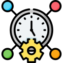
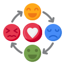
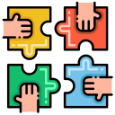
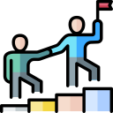
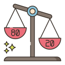

<h1 align="center"> Hello everyone 👋 </h1>

Dear reader, my adventure with technology began at 15, I worked for a while and bought a computer, I quickly got bored of social networks and I wondered ¿what else can be done with a computer? that's where it all started.

I learned about programming on my own, some time later I started working in customer service in a technology company, I wanted to be a programmer and showed that I could, I currently work as DevOps and continue in search of new experiences. 

Sometimes i write in my blog [Medium](https://medium.com/@alan6arley) 💬

You can find my certifications at [Credly](https://www.credly.com/users/alan-arley-contreras/badges) 📜

## 📫 You can find me: 
✨ [LinkedIn](https://www.linkedin.com/in/alan6arley/)

✨ [G-Mail](mailto:alan6arley@gmail.com?subject=[GitHub]%20Source%20ReadMe%20Profile)

## 🔧 Technologies & Tools
<!-- Icons from: https://simpleicons.org/ -->

<!-- Icons from: https://www.flaticon.com/ -->
## ❤️ Interpersonal skills
| Time Mngmt | Emotional Intel | Problem Solving | Critical Thinking | Creative Thinking | Teamwork | Leadership |
| --- | --- | --- | --- | --- | --- | --- |
||||||||

## 🔰 Principles and others
| [80/20](https://en.wikipedia.org/wiki/Pareto_principle) | [K.I.S.S](https://en.wikipedia.org/wiki/KISS_principle) | [Automation](https://en.wikipedia.org/wiki/Automation) |
| --- | --- | --- |
||||

## &#x1f4c8; GitHub Stats
| Github Stats | Top Languages |
| --- | --- |
|  |  |

## 😂 Now a random joke!

